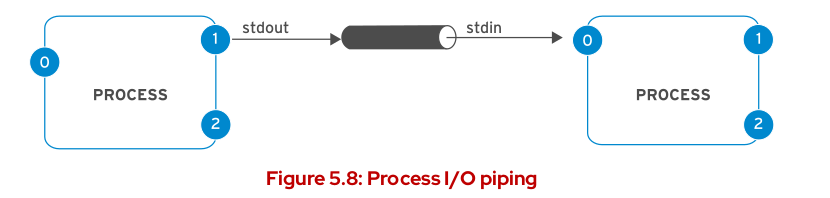
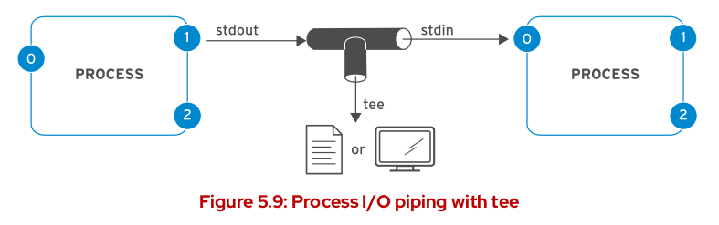

# Coposite commands: __continued__


## **What is a pipe ?**
> Mechanism for communication with different processes. It enables one process to send information to other process.

> 

> A pipe is a unidirectional mechanism, so if you need data to flow in both directions, you will need two pipes(One for each direction)

## **Using Pipes**
---
`$ <command-1> | <command-2> | <command-3>`

### **Examples:**

```bash

$ cat log-file.log | grep "Error"

$ man gzip | grep -i "compress"

$ cat file1 file2 | grep -i "compress"

$ cat * | grep -i "error" | grep -v "severe" | sort > file.log

```

## **More about pipes**

### **tee** command:

> The tee command sends the output to a set of files as well as the stdout

> `<command> | tee <list of Sinks>`

> 

### **Examples:**

> `g++ -g test1.cpp; ./a.out | tee out.txt` (Output to the screen and the file)

> `g++ -g test2.cpp; ./a.out | tee -a out.txt` (Same, but uses append mode)

> `date | tee file1 file2 file3 file4` (Output to the screen and the 4 files)

> `g++ -g test1.cpp; ./a.out | tee out.txt >> file.txt` (output goes to out.txt and then redirect it to append file.txt)


---
## **Commands Arguments Expansion**

* ### **Parameter Expansion  `$` and `${}`**:
    * The parameter Expansion is used to evaluate shell and environment variables

    * **Examples:**
        ```bash
        echo $PATH

        echo ${PATH}

        MY_NAME=TOM --> No spaces

        echo "My name is $MY_NAME"
        ```

---

* ### **Arithmetic Expansion `$(())`**:

    *  The arithmetic expansion is used to evaluate an arithmetic exression

    * **Examples:**

    ```bash
    echo $((5 + 6)) --> 11

    echo $((((5**2)) * 3)) --> 75

    echo $((5 % 2)) --> 1
    ``` 
---

* ### **Brace Expansion `{}`**
    * to repeat the command for every option in the curly brackets

    * **Examples:**
    ```bash
    echo abc-{A,B,C}def --> note: 
    no spaces in the brackets
    

    echo Ahmed{A{1,2},B{3,4}}
    ```
---

### **Differences between Single & double quotations**

|Property|Double `" "`|Single `' '`|
|-----|-----------|--------------|
|_protect strings_|Protect| Protect
|_protect arithmetic Expansion_|Protect|Protect|
|_Variable retrieval_| Doesn't protect varibles| prootect variables